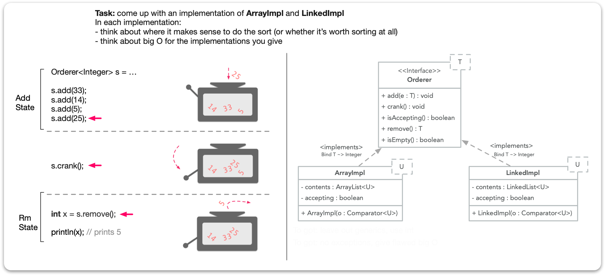

# The Orderer Machine

In this assignment you will provide two implementations of an abstract data type termed the `Orderer` --
a 'machine' for ordering generic items. 

## Part 1: Implementing the `Orderer` interface

> The work in the M06 lecture videos (where a singly linked list is developed) can help 
with the generics here. 

The `Orderer` interface can be thought of as a conceptualization of a 
machine that operates in two states: add -- where users toss in items, and rm (removal) 
states where users can remove items one at a time in order.

You will provide two implementations of this `Orderer` ADT -- as shown in the UML. 
* the first implementation must use an `ArrayList` to store the contents 
of the machine, while the second implementation must use a (java util) `LinkedList`.

* each implementation should use a distinct strategy... e.g., one might consider sorting the list,
while the other should use some different strategy for finding and removing the smallest.

Note: if the machine is in an accepting state, then attempting to add an item should 
produce an `IllegalStateException`. Attempting to remove from the machine 
when it's accepting new items should trigger this same exception. 

Users of the machine can toggle the machine back and forth from an accepting to 
a removal state by calling `crank()`.

## Part 2: Unit Testing

Write unit tests for the `Orderer` and its two implementations. 

Note that you're testing two separate implementations of an interface and its core operations. Meaning 
the methods you'll be testing for each implementation will (by definition) should have the same behavior. 

> For example, the `add` method just adds: doesn't say anything about where or in what 
order it's getting added (whether you are testing the first implementation or the second).

This also slightly complicates `toString` as the order in which items are stored across both implementations 
may vary -- so consider writing your unit tests such that you're not merely comparing toString representations 
of each class.

Check to see if there are jUnit mechanisms (or others) to reduce the need to duplicate your tests for both 
implementations. 

## Part 3: Brief Reflection

Write about any challenges (with generics, coming up with runtimes, etc.). Discuss how you 
approached testing and some of the key differences between both of your two implementations 
of the `Orderer` interface. 

# Handin

When you are ready to submit (or simply want to 'checkin' your work for the day), open the terminal,
cd to the project directory, then make a commit by typing:

> git commit -am "message goes here"

then follow this up with a

> git push origin main